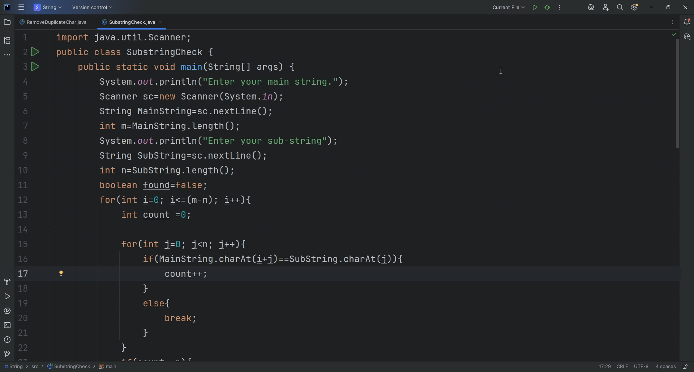

# SubstringCheck

## Description
SubstringCheck is a simple Java program that allows users to check whether a given substring exists inside a main string. The program manually compares each character of the substring with parts of the main string, simulating substring checking without using built-in methods like `.contains()` or `.substring()`.

## Features
- Takes user input for main string and substring.
- Checks for the substring manually using loops.
- Prints whether the substring is found or not.
- Works for strings of any length (as long as substring length ≤ main string length).

## Usage
1. Clone the repository.
2. Compile the program:
3. Run the program:
🎥 Demo Output

